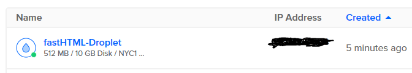
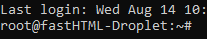
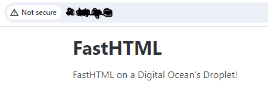

# Deploying a fastHTML Web App on a DigitalOcean Droplet

This guide details the process of setting up a $4/month Ubuntu Virtual Machine (Droplet) on DigitalOcean to host a fastHTML web application. It leverages the DigitalOcean API to streamline the creation and configuration of SSH keys and the Droplet itself.

### References
- [How to Create a Droplet](https://docs.digitalocean.com/products/droplets/how-to/create/)
- [How to Create a Personal Access Token](https://docs.digitalocean.com/reference/api/create-personal-access-token/)
- [How To Install Python 3 and Set Up a Programming Environment on an Ubuntu 20.04 Server](https://www.digitalocean.com/community/tutorials/how-to-install-python-3-and-set-up-a-programming-environment-on-an-ubuntu-20-04-server)
- [Cómo subir una app con FastAPI a DigitalOcean](https://www.youtube.com/watch?v=ZZNZbnTbodI)
- [DEPLOY a DJANGO app with SQLite database on DIGITALOCEAN (Ubuntu 22.04) -- NO DOCKER](https://www.youtube.com/watch?v=pUG-uNzWAf4)


### Setup
Run the commands below on your local machine.

```commandline
git clone https://github.com/AnswerDotAI/fh-deploy.git
cd fh-deploy/droplet
pip install -r requirements.txt
```

### Run the app locally
```commandline
uvicorn main:app --reload
```

### Deploying to DigitalOcean

#### Setting Up DigitalOcean

1. Create a DigitalOcean [account](https://www.digitalocean.com/)
2. Create a new Personal Access Token [here](https://cloud.digitalocean.com/account/api/tokens)
3. Create a `DIGITALOCEAN_TOKEN` environment variable (e.g. run `export DIGITALOCEAN_TOKEN=YOUR_API_TOKEN`).

#### Create an SSH key

[API Docs](https://docs.digitalocean.com/reference/api/api-reference/#operation/sshKeys_create)

1. Create a public key, run `ssh-keygen`.
2. When asked, save it to `/home/{user}/.ssh/{public_key_filename}`.
3. Store it as an environment variable `PUBLIC_KEY`.

```commandline
ssh-keygen
(...)
export PUBLIC_KEY=$(cat /home/{user}/.ssh/{public_key_filename}.pub)
```
4. Generate the SSH key using the API endpoint and passing the public key just created.

```curl
curl -X POST \
  -H "Content-Type: application/json" \
  -H "Authorization: Bearer $DIGITALOCEAN_TOKEN" \
  -d '{"name":"fastHTML SSH Public Key","public_key":"'"$PUBLIC_KEY"'"}' \
  "https://api.digitalocean.com/v2/account/keys" 
```

5. After the API call, copy the returned SSH key ID and store it as an environment variable (e.g. run `export SSH_KEY_ID=RETURNED_SSH_KEY_ID`).


#### Creating a new Droplet

[API Docs](https://docs.digitalocean.com/reference/api/api-reference/#operation/droplets_create)

1. While the DigitalOcean interface offers Droplet creation, this guide demonstrates the process using the API.

The $4/month Droplet will have the following specifications:

- name: `fastHTML-Droplet`
- region: `nyc1`
- size: `s-1vcpu-512mb-10gb` (1 CPU, 512 MB, 10 GB SSD Disk)
- OS: `Ubuntu 22.04 (LTS) x64`

```curl
$ curl -X POST \
  -H "Content-Type: application/json" \
  -H "Authorization: Bearer $DIGITALOCEAN_TOKEN" \
  -d '{"name":"fastHTML-Droplet","region":"nyc1","size":"s-1vcpu-512mb-10gb","image":"ubuntu-22-04-x64","ssh_keys":['"$SSH_KEY_ID"']}' \
  "https://api.digitalocean.com/v2/droplets"
```
Go to [droplets](https://cloud.digitalocean.com/droplets) and see that the droplet was just created:



2. Save the IP address as an environment variable `export IP_ADDRESS=DROPLET_IP_ADDRESS`

3. Before attempting to SSH into the Droplet, ensure the security of your public SSH key file by setting its permissions appropriately. 
   
```commandline
chmod 600 /home/{user}/.ssh/{public_key_filename}.pub
ssh -i /home/{user}/.ssh/{public_key_filename} root@$IP_ADDRESS
```
4. If everything has been configured correctly, you should be able to connect successfully.



#### Configuring python in the Droplet

1. After the SSH connection is established, start configuring the remote server.

These commands prepare your Ubuntu system for Python development and web application deployment by updating packages, installing necessary tools and libraries, and setting up a web server (Nginx).

```commandline
sudo apt-get update
sudo apt update
sudo apt -y upgrade
sudo apt install -y python3-pip
sudo apt install -y build-essential libssl-dev libffi-dev python3-dev python3-setuptools python3-venv
sudo apt install nginx
```

- If asked, reboot the server with `sudo reboot`
- If you navigate to `http://DROPLET_IP_ADDRESS` you should see "Welcome to nginx!" page.

2. Clone the repository

```commandline
mkdir project
cd project
python3 -m venv env
source env/bin/activate
git clone https://github.com/AnswerDotAI/fh-deploy.git
cd fh-deploy/droplet
pip install -r requirements.txt
```

#### Configuring Nginx

1. Create a file called `fasthtml` in the folder `/etc/nginx/sites-available`.
   
```commandline
sudo nano /etc/nginx/sites-available/fasthtml
```

2. Add the following text to the file:
```
server {
    server_name DROPLET_IP_ADDRESS;
    location / {
        include proxy_params;
        proxy_pass http://127.0.0.1:8000;
    }
}
```

3. Create a symbolic link in Nginx to enable a the configuration file.

```commandline
sudo ln -s /etc/nginx/sites-available/fasthtml /etc/nginx/sites-enabled/
```

To see the status of Nginx server run `systemctl status nginx.service`

#### Install Gunicorn and test if it works
```commandline
pip install gunicorn
gunicorn -w 4 -k uvicorn.workers.UvicornWorker main:app
```
You should now see:



#### Run Gunicorn as a service

1. Create a file called `fasthtml.service` in the folder `/etc/systemd/system`.
   
```commandline
sudo nano /etc/systemd/system/fasthtml.service
```

2. Add the following text to the file:
```
[Unit]
Description=Your Description

[Service]
WorkingDirectory=/root/project/fh-deploy/droplet
Environment="PATH=/root/project/env/bin"
ExecStart=/root/project/env/bin/gunicorn -w 4 -k uvicorn.workers.UvicornWorker main:app

[Install]
WantedBy=multi-user.target
```

3. Start the service.
```commandline
sudo systemctl start fasthtml.service
```

And that's it, you should see your web app.  

To see the status of the service, run `sudo systemctl status fasthtml.service`