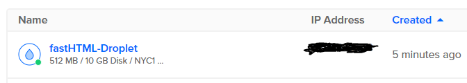
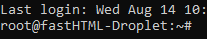
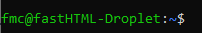
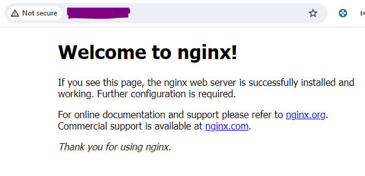
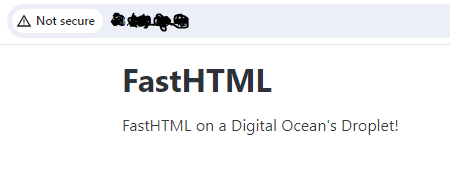

# Deploying a fastHTML Web App on a DigitalOcean Droplet

This guide details the process of setting up a $4/month Ubuntu Virtual Machine (Droplet) on DigitalOcean to host a fastHTML web application. It leverages the DigitalOcean API to streamline the creation and configuration of SSH keys and the Droplet itself.

### References
- [How to Create a Droplet](https://docs.digitalocean.com/products/droplets/how-to/create/)
- [How to Create a Personal Access Token](https://docs.digitalocean.com/reference/api/create-personal-access-token/)
- [How To Install Python 3 and Set Up a Programming Environment on an Ubuntu 20.04 Server](https://www.digitalocean.com/community/tutorials/how-to-install-python-3-and-set-up-a-programming-environment-on-an-ubuntu-20-04-server)
- [Cómo subir una app con FastAPI a DigitalOcean](https://www.youtube.com/watch?v=ZZNZbnTbodI)
- [DEPLOY a DJANGO app with SQLite database on DIGITALOCEAN (Ubuntu 22.04) -- NO DOCKER](https://www.youtube.com/watch?v=pUG-uNzWAf4)

### Setup
Run the commands below in your local machine.

```commandline
git clone https://github.com/AnswerDotAI/fh-deploy.git

cd fh-deploy/droplet
pip install -r requirements.txt
```

### Run the App Locally
```commandline
uvicorn main:app --reload
```

### Deploying to DigitalOcean

#### Setting Up DigitalOcean

1. Create a DigitalOcean [account](https://www.digitalocean.com/).
2. Create a new Personal Access Token [here](https://cloud.digitalocean.com/account/api/tokens). Select **Custom Scopes**, and only `ssh_key` and `droplet` scopes are needed.
3. Create a `DIGITALOCEAN_TOKEN` environment variable (e.g. run `export DIGITALOCEAN_TOKEN=YOUR_API_TOKEN`).

#### Create a SSH Key

[API Docs](https://docs.digitalocean.com/reference/api/api-reference/#operation/sshKeys_create)

1. Generate a new SSH key pair, save them in the specified path and file, adding a passphrase.

```commandline
ssh-keygen -f ~/.ssh/YOUR_KEY_FILE -N YOUR_PASSPHRASE
```

2. Store the public key in an environment variable `PUBLIC_KEY`.

```commandline
export PUBLIC_KEY=$(cat ~/.ssh/YOUR_KEY_FILE.pub)
```

3. Generate the SSH key using this API endpoint and passing the public key that was just created.

```curl
curl -X POST \
  -H "Content-Type: application/json" \
  -H "Authorization: Bearer $DIGITALOCEAN_TOKEN" \
  -d '{"name":"fastHTML SSH Key","public_key":"'"$PUBLIC_KEY"'"}' \
  "https://api.digitalocean.com/v2/account/keys" 
```

4. After the API call, copy the SSH key ID from the response and store it as an environment variable.

```commandline
export SSH_KEY_ID=RETURNED_SSH_KEY_ID
```

#### Creating a New Droplet

[API Docs](https://docs.digitalocean.com/reference/api/api-reference/#operation/droplets_create)

1. While the DigitalOcean interface offers Droplet creation, this guide demonstrates the process using the API. Note that the `SSH_KEY_ID` is passed.

The $4/month Droplet will have the following specs:

- name: `fastHTML-Droplet`
- region: `nyc1`
- size: `s-1vcpu-512mb-10gb` (1 CPU, 512 MB, 10 GB SSD Disk)
- OS: `Ubuntu 22.04 (LTS) x64`

```curl
curl -X POST \
  -H "Content-Type: application/json" \
  -H "Authorization: Bearer $DIGITALOCEAN_TOKEN" \
  -d '{"name":"fastHTML-Droplet","region":"nyc1","size":"s-1vcpu-512mb-10gb","image":"ubuntu-22-04-x64","ssh_keys":['"$SSH_KEY_ID"']}' \
  "https://api.digitalocean.com/v2/droplets"
```
Go to [droplets](https://cloud.digitalocean.com/droplets) and see that the droplet was just created.



2. Copy and save the IP address as an environment variable `export IP_ADDRESS=DROPLET_IP_ADDRESS`

3. Before attempting to SSH into the Droplet, ensure the security of your public SSH key file by setting its permissions appropriately. 
   
```commandline
chmod 600 ~/.ssh/YOUR_KEY_FILE.pub
ssh -i ~/.ssh/YOUR_KEY_FILE root@$IP_ADDRESS
```

4. If everything has been configured correctly, you should now be connected to the Droplet.



#### Adding a User (Recommended)

This step is recommended but not strictly required. If you choose not to create a dedicated user and continue using the root account, please remember to adjust the file paths mentioned in the following steps. The paths provided assume you're working as a regular user, not as root.

Creating the new user:  
  
1. Create a new user account with a given username.
2. Add the new user to the sudo group, granting them the ability to run commands with administrative privileges.
3. Copy the entire contents of the root user's SSH directory (/root/.ssh) to the new user's home directory.
4. Change the ownership of the copied SSH directory and its contents to the new user.
5. Disconnect from the remote server.
  
```commandline
adduser YOUR_USERNAME
adduser YOUR_USERNAME sudo
cp -Rfv /root/.ssh /home/YOUR_USERNAME/
chown -Rfv YOUR_USERNAME:YOUR_USERNAME /home/YOUR_USERNAME/.ssh
exit
```

#### SSH into the Server as the New User

```commandline
ssh -i ~/.ssh/YOUR_KEY_FILE YOUR_USERNAME@$IP_ADDRESS
```
You should now be connected into the Droplet, with your new user.



#### Configuring python in the Droplet

1. After the SSH connection is established, start configuring the remote server.

These commands prepare your Ubuntu system for Python development and web application deployment by updating packages, installing necessary tools and libraries, and setting up a web server (Nginx).

```commandline
sudo apt-get update
sudo apt update
sudo apt -y upgrade
sudo apt install -y python3-pip
sudo apt install -y build-essential libssl-dev libffi-dev python3-dev python3-setuptools python3-venv
sudo apt install nginx
```

- If asked, reboot the server with `sudo reboot`
- Now, if you navigate to `http://IP_ADDRESS`, the "Welcome to nginx!" page must be shown.



#### Setup the Web App

1. Clone the repository

```commandline
mkdir project
cd project
python3 -m venv env
source env/bin/activate
git clone https://github.com/AnswerDotAI/fh-deploy.git
cd fh-deploy/droplet
pip install -r requirements.txt
```

You should see something like this in your terminal:
```
(env) YOUR_USERNAME@fastHTML-Droplet:~/project/fh-deploy/droplet$
```

#### Configuring Nginx

1. Create a Nginx server block configuration file named `fasthtml`.
   
```commandline
sudo nano /etc/nginx/sites-available/fasthtml
```

2. Add the following text to the file.
```
server {
    server_name DROPLET_IP_ADDRESS;
    location / {
        include proxy_params;
        proxy_pass http://127.0.0.1:8000;
    }
}
```

This configuration will tell Nginx to listen for requests to your Droplet's IP address and proxy those requests to a local server running on port 8000. 

3. Nginx needs a symbolic link to the configuration files that are currently active.

```commandline
sudo ln -s /etc/nginx/sites-available/fasthtml /etc/nginx/sites-enabled/
```

4. Restart Nginx and the check its status.
```commandline
sudo systemctl restart nginx.service
systemctl status nginx.service
```

#### Install Gunicorn
```commandline
pip install gunicorn
gunicorn -w 4 -k uvicorn.workers.UvicornWorker main:app
```
You should now see:



#### Run Gunicorn as a service

1. Create a file called `fasthtml.service` in the folder `/etc/systemd/system`.
   
```commandline
sudo nano /etc/systemd/system/fasthtml.service
```

2. Add the following text to the file:
```
[Unit]
Description=Your Description

[Service]
WorkingDirectory=/home/YOUR_USERNAME/project/fh-deploy/droplet
Environment="PATH=/home/YOUR_USERNAME/project/env/bin"
ExecStart=/root/project/env/bin/gunicorn -w 4 -k uvicorn.workers.UvicornWorker main:app

[Install]
WantedBy=multi-user.target
```

3. Start the service.
```commandline
sudo systemctl start fasthtml.service
```

And that's it, you should see your web app.  

To see the status of the service, run `sudo systemctl status fasthtml.service`

#### Destroying the Droplet

Exit from the remote server by executing `exit` in the terminal.

1. List droplets and copy the id.

```curl
curl -X GET \
  -H "Content-Type: application/json" \
  -H "Authorization: Bearer $DIGITALOCEAN_TOKEN" \
  "https://api.digitalocean.com/v2/droplets"
```

```
export DROPLET_ID=YOUR_DROPLET_ID
```

2. Delete droplet.

```curl
curl -X DELETE \
  -H "Content-Type: application/json" \
  -H "Authorization: Bearer $DIGITALOCEAN_TOKEN" \
  "https://api.digitalocean.com/v2/droplets/$DROPLET_ID"
```